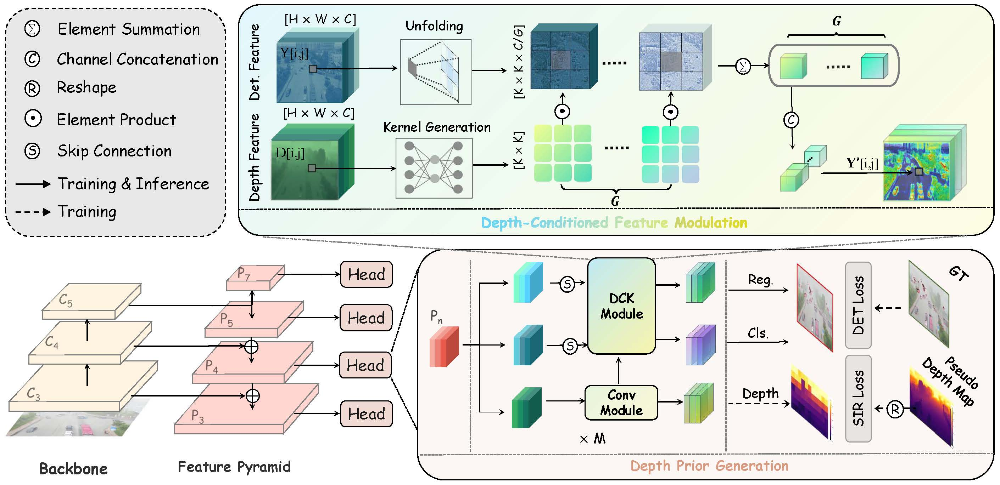

# HazyDet: Open-Source Benchmark for Drone-View Object Detection With Depth-Cues in Hazy Scenes
This repository is the official implementation of HazyDet

- [HazyDet](#hazydet)
    - [Leadboard and Model Zoo](#leadboard-and-model-zoo)
		- [Detectors](#detectors)
		- [Dehazing](#dehazing)
- [DeCoDet](#decodet)
    - [Installation](#installation)
		- [Step 1: Create a conda](#step-1-create-a-conda)
		- [Step 2: Install PyTorch](#step-2-install-pytorch)
		- [Step 3: Install OpenMMLab 2.x Codebases](#step-3-install-openmmlab-2x-codebases)
  		- [Step 4: Install `HazyDet`](#step-4-install-hazydet)
    - [Training](#training)
    - [Inference](#inference)
    - [Depth Maps](#depth-maps)
- [Acknowledgement](#acknowledgement)


## HazyDet


You can **download** our HazyDet dataset from [**Baidu Netdisk**](https://pan.baidu.com/s/1KKWqTbG1oBAdlIZrTzTceQ?pwd=grok) or [**OneDrive**](https://1drv.ms/f/s!AmElF7K4aY9p83CqLdm4N-JSo9rg?e=H06ghJ).<br>

For both training and inference, the following dataset structure is required:

```
HazyDet
|-- train
    |-- clean images
    |-- hazy images
    |-- labels
|-- val
    |-- clean images
    |-- hazy images
    |-- labels
|-- test
    |-- clean images
    |-- hazy images
    |-- labels
|-- real world 
    |-- training
    |-- testing	
    |-- labels
```

**Note: Both passwords for BaiduYun and OneDrive is `grok`**.


## Leadboard and Model Zoo

All the weight files in the model zoo can be accessed on [Baidu Cloud](https://pan.baidu.com/s/1EEX_934Q421RkHCx53akJQ?pwd=grok) and [OneDrive](https:).

### Detectors


| Model              | Backbone     | #Params (M) | GFLOPs | mAP on<br>Synthetic | mAP on<br>Real-world | Config | Weight |
|--------------------|--------------|-------------|--------|---------------------|----------------------|--------|--------|
| **One Stage**      |              |             |        |                     |                      |        |        |
| YOLOv3             | Darknet53    | 61.63       | 20.19  | 35.0                | 30.7                 | [config](./configs/yolov3/yolov3_d53_8xb8-ms-416-273e_hazydet.py) | [weight](https://pan.baidu.com/s/1EEX_934Q421RkHCx53akJQ?pwd=grok) |
| GFL                | ResNet50     | 32.26       | 198.65 | 36.8                | 32.5                 | [config](./configs/gfl/gfl_r50_fpn_1x_hazydet.py) | [weight](https://pan.baidu.com/s/1EEX_934Q421RkHCx53akJQ?pwd=grok) |
| YOLOX              | CSPDarkNet   | 8.94        | 13.32  | 42.3                | 35.4                 | [config](./configs/yolox/yolox_s_8xb8-300e_hazydet.py) | [weight](https://pan.baidu.com/s/1EEX_934Q421RkHCx53akJQ?pwd=grok) |
| FCOS               | ResNet50     | 32.11       | 191.48 | 45.9                | 32.7                 | [config](./configs/fcos/fcos_r50_1x_hazydet.py) | [weight](https://pan.baidu.com/s/1EEX_934Q421RkHCx53akJQ?pwd=grok) |
| VFNet              | ResNet50     | 32.71       | 184.32 | 49.5                | 35.6                 | [config](./configs/vfnet/vfnet_r50_fpn_1x_hazydet.py) | [weight](https://pan.baidu.com/s/1EEX_934Q421RkHCx53akJQ?pwd=grok) |
| ATTS               | ResNet50     | 32.12       | 195.58 | 50.4                | 36.4                 | [config](./configs/atts/atss_r50_fpn_1x_hazydet.py) | [weight](https://pan.baidu.com/s/1EEX_934Q421RkHCx53akJQ?pwd=grok) |
| DDOD               | ResNet50     | 32.20       | 173.05 | 50.7                | 37.1                 | [config](./configs/ddod/ddod_r50_fpn_1x_hazydet.py) | [weight](https://pan.baidu.com/s/1EEX_934Q421RkHCx53akJQ?pwd=grok) |
| TOOD               | ResNet50     | 32.02       | 192.51 | 51.4                | 36.7                 | [config](./configs/tood/tood_r50_fpn_1x_hazydet.py) | [weight](https://pan.baidu.com/s/1EEX_934Q421RkHCx53akJQ?pwd=grok) |
| **Two Stage**      |              |             |        |                     |                      |        |        |
| Faster RCNN        | ResNet50     | 41.35       | 201.72 | 48.7                | 33.4                 | [config](./configs/faster_rcnn/faster-rcnn_r50_fpn_1x_hazydet.py) | [weight](https://pan.baidu.com/s/1EEX_934Q421RkHCx53akJQ?pwd=grok) |
| Libra RCNN         | ResNet50     | 41.62       | 209.92 | 49.0                | 34.5                 | [config](./configs/libra_rcnn/libra-faster-rcnn_r50_fpn_1x_hazydet.py) | [weight](https://pan.baidu.com/s/1EEX_934Q421RkHCx53akJQ?pwd=grok) |
| Grid RCNN          | ResNet50     | 64.46       | 317.44 | 50.5                | 35.2                 | [config](./configs/grid_rcnn/grid-rcnn_r50_fpn_gn-head_1x_hazydet.py) | [weight](https://pan.baidu.com/s/1EEX_934Q421RkHCx53akJQ?pwd=grok) |
| Cascade RCNN       | ResNet50     | 69.15       | 230.40 | <u>51.6</u>         | <u>37.2</u>          | [config](./configs/cascade_rcnn/cascade-rcnn_r50_fpn_1x_hazydet.py) | [weight](https://pan.baidu.com/s/1EEX_934Q421RkHCx53akJQ?pwd=grok) |
| **End-to-End**     |              |             |        |                     |                      |        |        |
| Conditional DETR        | ResNet50     | 43.55       | 91.47 | 30.5            |25.8                | [config](./configs/conditional_detr/conditional-detr_r50_16xb2-50e_hazydet.py) | [weight](https://pan.baidu.com/s/1EEX_934Q421RkHCx53akJQ?pwd=grok) |
| DAB DETR        | ResNet50     | 43.7       | 91.02 | 31.3                | 27.2                | [config](./configs/dab_detr/dab-detr_r50_16xb2-50e_hazydet.py) | [weight](https://pan.baidu.com/s/1EEX_934Q421RkHCx53akJQ?pwd=grok) |
| Deform DETR        | ResNet50     | 40.01       | 203.11 | 51.5                | 36.9                 | [config](./configs/deform_detr/deformable-detr_r50_16xb2-50e_hazydet.py) | [weight](https://pan.baidu.com/s/1EEX_934Q421RkHCx53akJQ?pwd=grok) |
| **DeCoDet**  |              |             |        |                     |                      |        |        |
| **DeCoDet (Ours)** | ResNet50     | 34.62       | 225.37 | **52.0**            | **38.7**             | [config](./configs/DeCoDet/DeCoDet_r50_1x_hazydet.py) | [weight](https://pan.baidu.com/s/1EEX_934Q421RkHCx53akJQ?pwd=grok) |


### Dehazing

<table>
    <tr>
        <td>Type</td>
        <td>Method</td>
        <td>PSNR</td>
        <td>SSIM</td>
        <td>mAP on Test-set</td>
        <td></td>
        <td>mAP on RDDTS</td>
        <td>Weight</td>
    </tr>
    <tr>
        <td>Baseline</td>
        <td>Faster RCNN</td>
        <td>-</td>
        <td>-</td>
        <td>39.5</td>
        <td></td>
        <td>21.5</td>
        <td><a href="https://pan.baidu.com/s/1EEX_934Q421RkHCx53akJQ?pwd=grok">weight</a></td>
    </tr>
    <tr>
        <td>Dehaze</td>
        <td>GridDehaze</td>
        <td>12.66</td>
        <td>0.713</td>
        <td>38.9 (-0.6)</td>
        <td></td>
        <td>19.6 (-1.9)</td>
        <td><a href="https://pan.baidu.com/s/1EEX_934Q421RkHCx53akJQ?pwd=grok">weight</a></td>
    </tr>
    <tr>
        <td>Dehaze</td>
        <td>MixDehazeNet</td>
        <td>15.52</td>
        <td>0.743</td>
        <td>39.9 (+0.4)</td>
        <td></td>
        <td>21.2 (-0.3)</td>
        <td><a href="https://pan.baidu.com/s/1EEX_934Q421RkHCx53akJQ?pwd=grok">weight</a></td>
    </tr>
    <tr>
        <td>Dehaze</td>
        <td>DSANet</td>
        <td>19.01</td>
        <td>0.751</td>
        <td>40.8 (+1.3)</td>
        <td></td>
        <td>22.4 (+0.9)</td>
        <td><a href="https://pan.baidu.com/s/1EEX_934Q421RkHCx53akJQ?pwd=grok">weight</a></td>
    </tr>
    <tr>
        <td>Dehaze</td>
        <td>FFA</td>
        <td>19.25</td>
        <td>0.798</td>
        <td>41.2 (+1.7)</td>
        <td></td>
        <td>22.0 (+0.5)</td>
        <td><a href="https://pan.baidu.com/s/1EEX_934Q421RkHCx53akJQ?pwd=grok">weight</a></td>
    </tr>
    <tr>
        <td>Dehaze</td>
        <td>DehazeFormer</td>
        <td>17.53</td>
        <td>0.802</td>
        <td>42.5 (+3.0)</td>
        <td></td>
        <td>21.9 (+0.4)</td>
        <td><a href="https://pan.baidu.com/s/1EEX_934Q421RkHCx53akJQ?pwd=grok">weight</a></td>
    </tr>
    <tr>
        <td>Dehaze</td>
        <td>gUNet</td>
        <td>19.49</td>
        <td>0.822</td>
        <td>42.7 (+3.2)</td>
        <td></td>
        <td>22.2 (+0.7)</td>
        <td><a href="https://pan.baidu.com/s/1EEX_934Q421RkHCx53akJQ?pwd=grok">weight</a></td>
    </tr>
    <tr>
        <td>Dehaze</td>
        <td>C2PNet</td>
        <td>21.31</td>
        <td>0.832</td>
        <td>42.9 (+3.4)</td>
        <td></td>
        <td>22.4 (+0.9)</td>
        <td><a href="https://pan.baidu.com/s/1EEX_934Q421RkHCx53akJQ?pwd=grok">weight</a></td>
    </tr>
    <tr>
        <td>Dehaze</td>
        <td>DCP</td>
        <td>16.98</td>
        <td>0.824</td>
        <td>44.0 (+4.5)</td>
        <td></td>
        <td>20.6 (-0.9)</td>
        <td><a href="https://pan.baidu.com/s/1EEX_934Q421RkHCx53akJQ?pwd=grok">weight</a></td>
    </tr>
    <tr>
        <td>Dehaze</td>
        <td>RIDCP</td>
        <td>16.15</td>
        <td>0.718</td>
        <td>44.8 (+5.3)</td>
        <td></td>
        <td>24.2 (+2.7)</td>
        <td><a href="https://pan.baidu.com/s/1EEX_934Q421RkHCx53akJQ?pwd=grok">weight</a></td>
    </tr>
</table>


## DeCoDet


### Installation

#### Step 1: Create a conda 

```shell
$ conda create --name HazyDet python=3.9
$ source activate HazyDet
```

#### Step 2: Install PyTorch

```shell
conda install pytorch torchvision torchaudio pytorch-cuda=12.1 -c pytorch -c nvidia
```

#### Step 3: Install OpenMMLab 2.x Codebases

```shell
# openmmlab codebases
pip install -U openmim --no-input
mim install mmengine "mmcv>=2.0.0" "mmdet>=3.0.0" "mmsegmentation>=1.0.0" "mmrotate>=1.0.0rc1" mmyolo "mmpretrain>=1.0.0rc7" 'mmagic'
# other dependencies
pip install -U ninja scikit-image --no-input
```

#### Step 4: Install `HazyDet`

```shell
python setup.py develop
```


### Training
```shell
 $ python tools/train_det.py configs/DeCoDet/DeCoDet_r50_1x_hazydet.py
```         


### Inference
```shell
$ python tools/test.py configs/DeCoDet/DeCoDet_r50_1x_hazydet.py weights/fcos_DeCoDet_r50_1x_hazydet.pth
```

We released our [checkpoint](https://pan.baidu.com/s/1EEX_934Q421RkHCx53akJQ?pwd=grok) on HazyDet <br>

### Depth Maps

The depth map required for training can be obtained through [Metic3D](https://github.com/YvanYin/Metric3D). They can also be acquired through other depth estimation models.<br>

If you want to use our depth data, please download it and place it in the specified path. For convenience in storage and viewing, we save relative depth in PNG image format and the maximum depth in text format, but we use absolute depth during training.  


